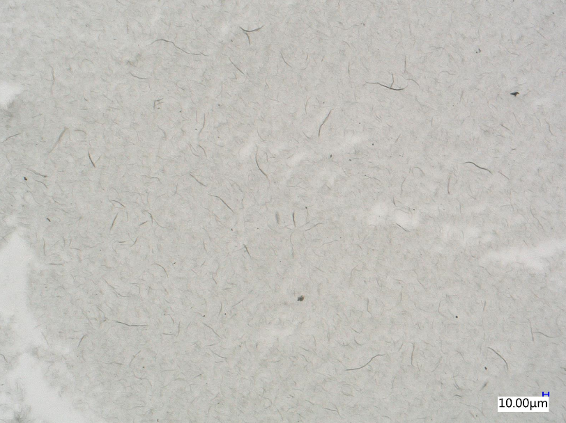

# OptCNT - 碳纳米管SEM图像分析系统

基于 Python + Tkinter + OpenCV 的碳纳米管 (CNT) SEM 图像分析工具，支持自动检测、长度测量与统计分析。

## 功能特性

### 核心功能
- **CNT自动检测** - 基于自适应阈值分割与骨架化算法
- **长度测量** - 精确测量每根CNT的长度(μm)
- **宽度估算** - 通过距离变换估算CNT直径
- **比例尺识别** - 自动检测图像中的比例尺
- **ROI管理** - 支持多区域选择与分析

### 图像预处理
- 高斯模糊降噪
- 自适应阈值二值化
- 形态学开/闭运算
- 骨架化提取

### 统计分析
- 长度分布直方图
- 长度占比饼状图
- 聚类分析(长度vs宽度)
- 详细统计信息(均值、标准差、极值)

### 现代化UI
- 多彩配色方案(靛蓝紫/紫色/粉色/青色)
- 半透明绿色二值图叠加显示
- 动态状态指示器
- 实时骨架预览
- 彩色统计信息标签

## 安装

### 环境要求
- Python 3.8+
- Windows / macOS / Linux

### 依赖安装

```bash
pip install -r requirements.txt
```

主要依赖：
- `opencv-python` - 图像处理
- `numpy` - 数值计算
- `Pillow` - 图像显示
- `matplotlib` - 图表绘制
- `scikit-image` - 骨架化算法
- `scikit-learn` - 聚类分析(可选)

## 使用方法

### 启动程序

```bash
python main.py
```

### 操作流程

1. **打开图像** - 点击"打开图像"按钮加载SEM图像
2. **设置比例尺** - 自动检测或手动设置比例尺(默认10μm)
3. **选择ROI** (可选) - 框选感兴趣区域进行分析
4. **调整参数** - 根据图像特征调整预处理参数
5. **检测CNT** - 点击"开始检测CNT"执行分析
6. **查看结果** - 在右侧面板查看统计数据和测量列表
7. **导出报告** - 支持CSV和JSON格式导出

### 显示模式

| 模式 | 说明 |
|------|------|
| 原图 | 显示原始图像及ROI框 |
| 二值图 | 半透明绿色叠加显示二值化结果 |
| 实时骨架预览 | 实时显示骨架化效果 |
| 检测结果 | 显示检测到的CNT轮廓 |
| 骨架结果 | 显示骨架与检测结果叠加 |

## 项目结构

```
OptCNT/
├── main.py           # 程序入口
├── gui.py            # GUI主控制器
├── analyzer_core.py  # 核心分析算法
├── panels.py         # 面板组件
├── widgets.py        # 自定义控件
├── models.py         # 数据模型
├── utils.py          # 工具函数
├── requirements.txt  # 依赖列表
└── README.md         # 说明文档
```

## 参数说明

### 预处理参数

| 参数 | 范围 | 说明 |
|------|------|------|
| 高斯模糊核 | 1-15 | 降噪强度，值越大越平滑 |
| 自适应块大小 | 3-51 | 局部阈值计算区域 |
| 自适应常数C | -10~10 | 阈值调整偏移量 |

### 过滤参数

| 参数 | 说明 |
|------|------|
| 最小长度(μm) | 过滤短于该值的CNT |
| 最大长度(μm) | 过滤长于该值的CNT |
| 最小长宽比 | 过滤长宽比过小的CNT |

## 截图示例



## 技术细节

### CNT检测流程
1. 图像预处理(高斯模糊 + 自适应阈值)
2. 形态学运算(开运算去噪 + 闭运算填充)
3. 骨架化提取中心线
4. 轮廓检测与筛选
5. 骨架路径追踪计算长度
6. 距离变换估算宽度

### 比例尺检测
- 基于颜色/边缘检测定位比例尺区域
- 支持蓝色、灰色等多种比例尺样式
- 自动识别比例尺长度(像素)

## 许可证

MIT License

## 贡献

欢迎提交 Issue 和 Pull Request！
